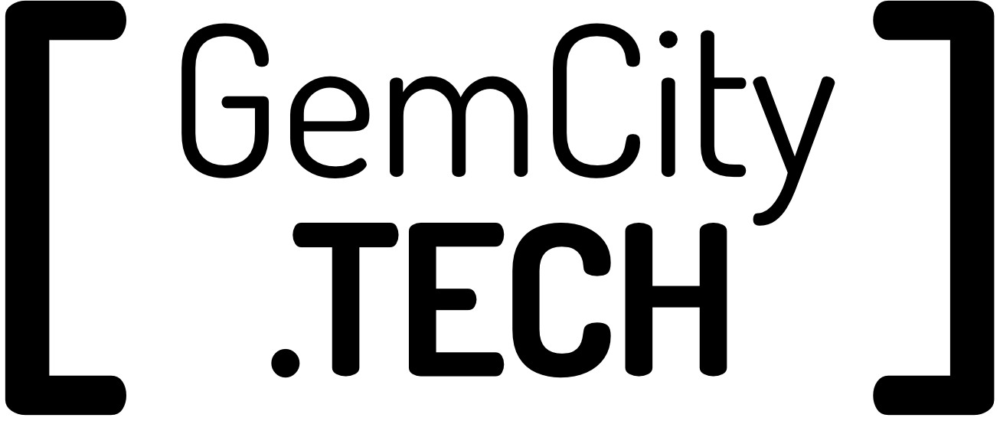
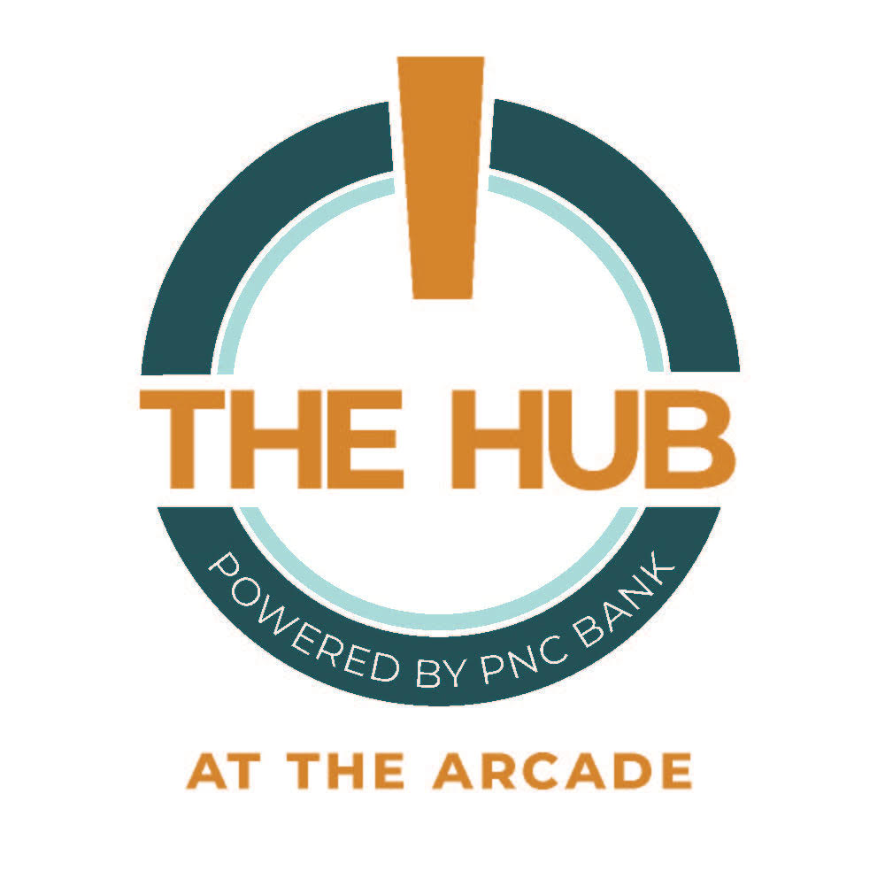

# GemCity-ML-AI, Challenge Problem to Challenging Problems
## Gem City Tech: Sept 15, 2022 Meetup
## Evelyn J. Boettcher
### [MeetUp link](https://www.meetup.com/gem-city-tech/events/287250190/)

## Meeting Outline

* Introductions
* Sponsors
* Pizza and drinks
* AFIT MagNav Challenge Problem
* Ethics: A Challenging Problem
* Open Discussion (seed topics)
   * What do you want to see next week
   * What do you want to in this meetup
   * Second round of introductions
   * What new tools/toys are you playing with?

## Introduction

I am, Evelyn Boettcher, and I am a physicist and have been doing machine learning on and off again before Tensorflow has been around.  There was not a ML/AI or even a data science /visualization around Dayton and I thought that needed to change so I asked Allen if I could host a ML/AI group under Gem City Tech.

Allen May is the main Gem City Tech leader. The go to guy for all things web related.

Gem City Tech is a family of user groups bringing tech-focused content to the Dayton Ohio community. Their calendar is filled with opportunities to learn and share information 'about all things tech'.

Join us on our Discord server: https://discord.gg/nyDtEytbt6
{:width="350px"}

### Request for Speakers and Ideas
If you are interested in speaking or have ideas please DM or post on the discord server.

evelyn@Ax-b.xyz

## Gem City ML / AI Sponsors 

|  |  
| :--: | 
|  | 
|  |
|  |

* GemCity TECH: [GemCity.Tech](https://Gemcity.tech)
* The Innovation Hub: [thehubdayton.com](https://www.thehubdayton.com/)
* Technology First: [www.technologyfirst.org](https://www.technologyfirst.org/)

### Calendar Events
* Gem City Tech ML AI: Third Thursday at 6.
* The GemCity TECH Meetup calendar of upcoming events: [www.meetup.com/gem-city-tech](https://www.meetup.com/gem-city-tech/events/calendar/)
* [The Technology First events calendar](https://www.technologyfirst.org/Technology-First-Events?EventViewMode=1&EventListViewMode=2&SelectedDate=8/20/2022&CalendarViewType=1)

---

## Todays Meetup: Challenge Problem to Challenging Problem

## Machine Learning for Magnetic Navigation

*Machine Learning for Magnetic Navigation* one of the Air Force AI Accelerator projects.  Dr. Aaron Nielsen from AFIT will talk about their ML challenge problem to help with Magnetic Navigation.

---

## ML Ethics: a challenging problem
Our lives are increasingly becoming more involved with ML algorithms.  From health diagnosis, fraud detection to tracking customers in stores. 

What happens when you get miss Identified in an Algorithm? 

This is cautionary tale of when AI gets a wrong identification (https://lnkd.in/e5neHt8E)

### Request for Speakers and Ideas
If you are interested in speaking or have ideas please DM or post on the discord server.

evelyn@Ax-b.xyz