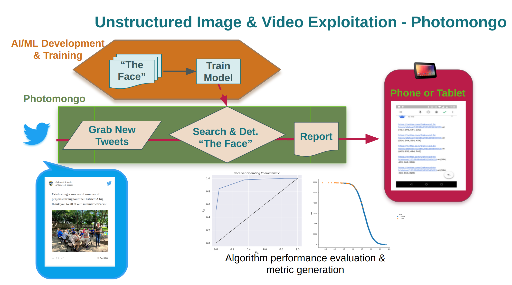

# GemCity-ML-AI_Models, Datasets and Transfer learning
## Gem City Tech: Aug 18, 2022 Meetup
## Evelyn J. Boettcher
### [MeetUp link](https://www.meetup.com/gem-city-tech/events/287250190/)

## Meeting Outline

* Introductions
* Sponsors
* Pizza and drinks
* Random tutorial
* Open Discussion (seed topics)
   * What do you want to see next week
   * What do you want to in this meetup
   * Second round of introductions
   * What new tools/toys are you playing with?

## Introduction

I am, Evelyn Boettcher, and I am a physicist and have been doing machine learning on and off again before Tensorflow has been around.  There is not currently a ML/AI or even a data science /visualization around Dayton and I thought that needed to change so I asked Allen if I could host a ML/AI group under Gem City Tech.

Allen May is the main Gem City Tech leader. Go to guy for all things web related.

Gem City Tech is a family of user groups bringing tech-focused content to the Dayton Ohio community. There calendar is filled with opportunities to learn and share information 'about all things tech'.

Join us on our Discord server: https://discord.gg/nyDtEytbt6

### Gem City ML / AI Sponsors 

|  |  
| :--: | 
|  | 
|  |
|  |

* GemCity TECH: [GemCity.Tech](https://Gemcity.tech)
* The Innovation Hub: [thehubdayton.com](https://www.thehubdayton.com/)
* Technology First: [www.technologyfirst.org](https://www.technologyfirst.org/)

### Calendar Events
* Gem City Tech: Third Thursday at 6.
* The GemCity TECH Meetup calendar of upcoming events: [www.meetup.com/gem-city-tech](https://www.meetup.com/gem-city-tech/events/calendar/)
* [The Technology First events calendar](https://www.technologyfirst.org/Technology-First-Events?EventViewMode=1&EventListViewMode=2&SelectedDate=8/20/2022&CalendarViewType=1)

## Intro to Datasets

[From Widipedia](https://en.wikipedia.org/wiki/Data_set)

A data set (dataset) is a collection of data.
Set is a math term and has the following properties: uniqueness.

### Wikipedia's  Classic Datasets

* Iris flower data set – Multivariate data set introduced by Ronald Fisher (1936).
* MNIST database – Images of handwritten digits commonly used to test classification, clustering, and image processing algorithms
* ''data analysis'' – Data sets used in the book, ''An Introduction to Categorical Data Analysis''.
* ''Robust statistics'' – Data sets used in ''Robust Regression and Outlier Detection''
* ''Time series'' – Data used in Chatfield's book, ''The Analysis of Time Series'', are [provided on-line by StatLib.](http://lib.stat.cmu.edu/modules.php?op=modload&name=PostWrap&file=index&page=datasets/ )
* ''Extreme values'' – Data used in the book, ''An Introduction to the Statistical Modeling of Extreme Values'' are [a snapshot of the data as it was provided on-line by Stuart Coles](https://web.archive.org/web/20060910161517/http://homes.stat.unipd.it/coles/public_html/ismev/ismev.dat), the book's author.
* ''Bayesian Data Analysis'' – Data used in the book are [ provided on-line](http://www.stat.columbia.edu/~gelman/book/data/) by [[Andrew Gelman]], one of the book's authors.
* The [Bupa liver data](https://web.archive.org/web/20171023174701/http://ftp.ics.uci.edu:80/pub/machine-learning-databases/liver-disorders/ ) – Used in several papers in the machine learning (data mining) literature.
* Anscombe's quartet – Small data set illustrating the importance of graphing the data to avoid statistical fallacies

There are several portals giving access to data sets:
* [https://data.gov.uk/ Data Gov UK]
* [https://data.gov/ Data Gov US]
* [https://ourworldindata.org/ Our World In Data]
* [https://data.fivethirtyeight.com/ Five Thirty Eight]
* [https://www.workwithdata.com/ Work With Data]

### TensorFlow Datasets

TensorFlow has curated lots of datasets for one to use. 
TensorFlow dataset can be found here [https://www.tensorflow.org/datasets/catalog/overview](https://www.tensorflow.org/datasets/catalog/overview)
and it ranges for Audio to imagery.  Many of these datasets are from publicly released challenge problems.

## Models
There are many trained models in the wild that you can use.  Highly recommended for you to use a model from a trusted source.  

Example: 
[Face Recognition](https://github.com/ageitgey/face_recognition)
[Dlib](http://dlib.net/)

### Tensorflow
TensorFlow provides many trained models for free that you can use. 
[TensorFlow Models](https://github.com/tensorflow/models)
[TensorFlow Hub](https://tfhub.dev/)

----- 

### Let's play: TensorFlow Tutorial

First let's walk through the TensorFlow's Model Transfer
[image transfer Lerning](https://www.tensorflow.org/tutorials/images/transfer_learning_with_hub) 

### Let's play: Personal project 

[Photomongo](https://github.com/anielsen001/photomongo)

#### Why my family created this

Daughter's school keep posting image of her on the internet.  We had to notify the school to remove images to get them removed.  In order to do that, we need a way of finding out if her image was posted.

Scanning multiple sites was too time consuming for my family.  However, scanning multiple sites is not CPU intensive.

This gave birth to PhotoMongo!  

[photomongo Git](https://github.com/anielsen001/photomongo)

It uses serval open source projects.
* [Face Recognition](https://github.com/ageitgey/face_recognition)
* [Dlib](http://dlib.net/)

Unfortunatly, I could not commerialize this because twitter does not allow companies to use their API in this manor.  It would have been great to have this easily available for ofther parents worried about cyber bulling, stalking and unauthorized image posting.

